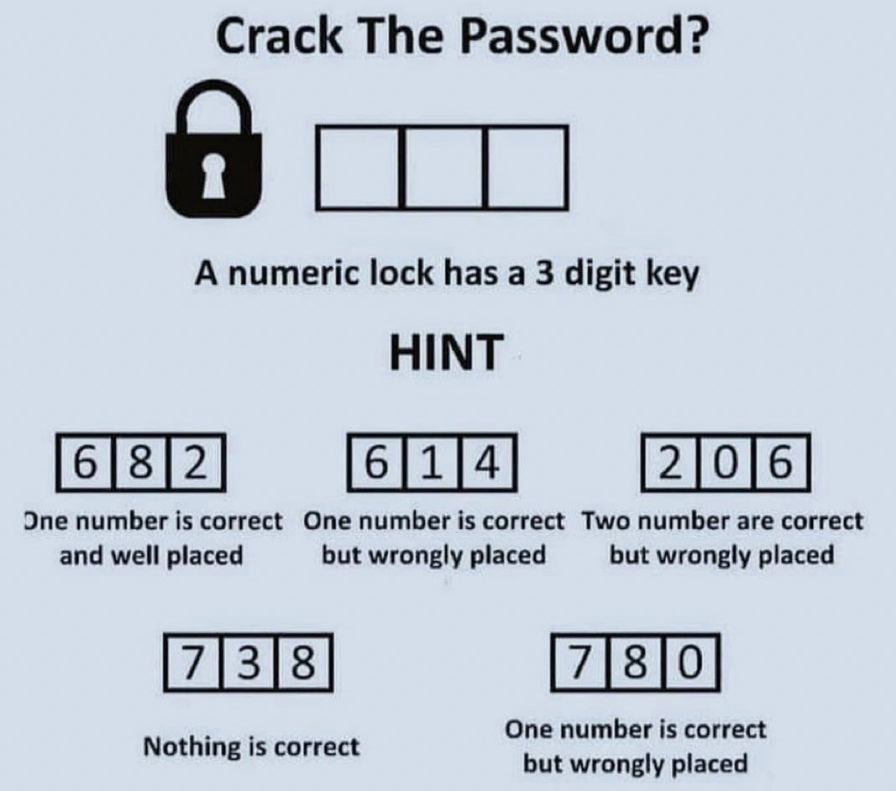

# lock_guess
Overview
This Python script is designed to solve a 3-digit code based on a series of guesses and feedback. The script generates all possible combinations of digits, validates them against the given feedback rules, and identifies the correct code.

How It Works
Input
The script starts with an array of guesses, each of which includes:

guess: A list of three digits representing a potential code.
correct: The number of digits in the correct position.
wrong_position: The number of correct digits in the wrong position.
none_of_these (optional): A flag indicating that none of the digits in this guess are part of the code.
Process
Identify Possible and Impossible Digits:

Digits confirmed not to be part of the code are stored in the not_this list.
Digits that might be part of the code are stored in the maybe list after filtering out those in not_this.
Generate Possible Combinations:

All permutations of the maybe digits for 3 positions are generated as possible code combinations.
Validation:

Each possible combination is validated against the feedback from the guesses.
The combination is checked for the number of correct digits and digits in the wrong position.
Filter Valid Combinations:

Only combinations that satisfy all the given rules are considered valid and are output as potential solutions.
Output
The script outputs a list of valid combinations that could be the correct code.

Requirements
Python 3.x
No additional libraries are required beyond Python's standard library.

Usage
Clone or Download this repository.
Run the script:
bash
Copy code
python3 lock_guess.py
View the output: The script will print the valid combinations that could be the correct code.
Example
Given the following guesses:

python
Copy code
guesses = [
    {"guess": [6, 8, 2], "correct": 1, "wrong_position": 0},
    {"guess": [6, 1, 4], "correct": 0, "wrong_position": 1},
    {"guess": [2, 0, 6], "correct": 0, "wrong_position": 2},
    {"guess": [7, 3, 8], "correct": 0, "wrong_position": 0, "none_of_these": True},
    {"guess": [7, 8, 0], "correct": 0, "wrong_position": 1},
]
The script will output:

bash
Copy code
Valid combinations: [(0, 4, 2)]
Indicating that 042 is the correct code.

License
This project is licensed under the MIT License.

Contributing
Contributions are welcome! Please fork the repository and submit a pull request with your changes.
